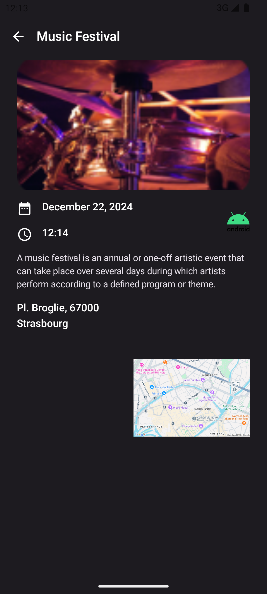

 

# P15 - Projet Eventorias

- Application permettant de consulter et ajouter des évènements.
- Fonctionnalités : Prise de photos, sélection de photos dans la galerie, activation des notifications
- Compatibilité : Version minimale Android 7

## Technologies
- Jetpack Compose
- Kotlin 
- Backend Firebase :
	- Authentication
	- Firestore Database
	- Storage
	- Messaging
	- App Distribution

## Concepts

- Pattern : MVVM
- Tests : Unitaires et instrumentés
- CI / CD : GitHub Actions pour lancer les tests à chaque push et déployer l'application à chaque tag.
- Accessibilité : Validation d'Accessibility Scanner + tests manuels avec TalkBack
- UI : portrait, paysage, téléphone et tablette

## Impressions d'écran

	
	
	

	

